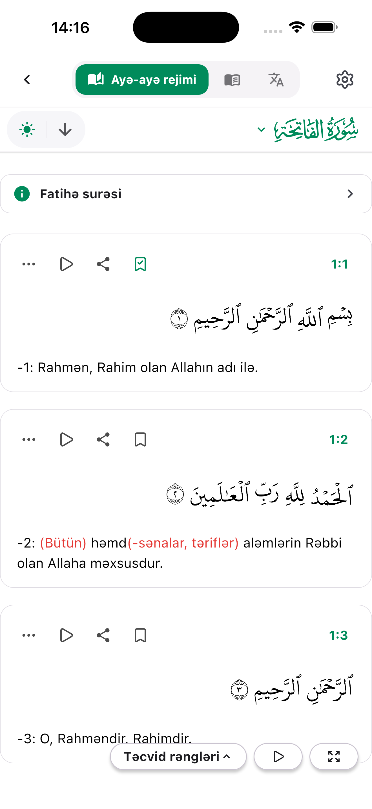
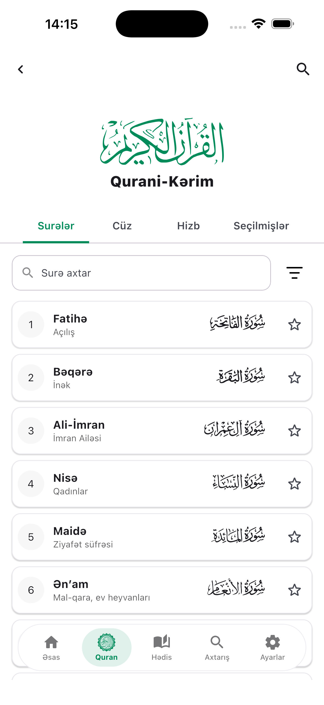
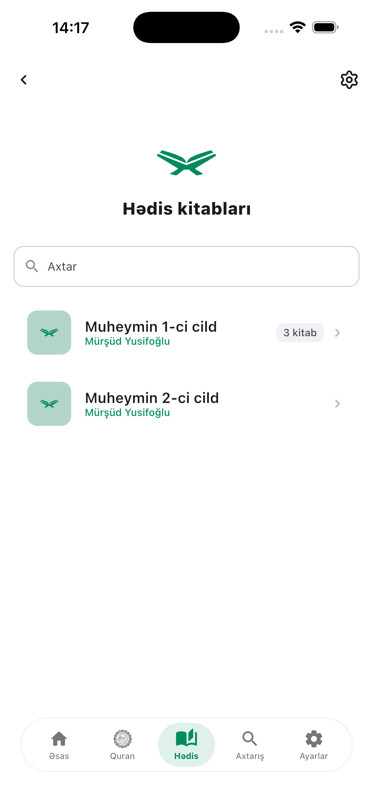
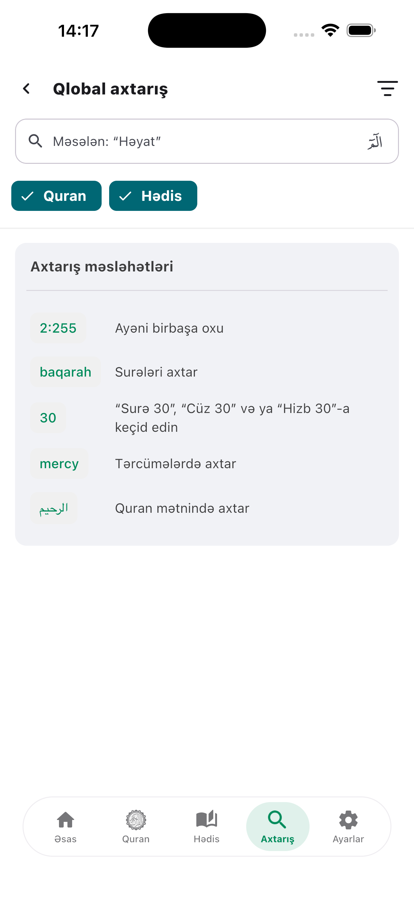

<div align="center">


[](README.az.md)


# AnaMuslim · Ənə Muslim

**Qur'an and hadith, in Azerbaijani — ad-free, offline, and correctable by its own readers.**

[](https://github.com/cafarovceyxun/AnaMuslim/actions/workflows/android.yml)
[](LICENSE)
[](https://kotlinlang.org/docs/multiplatform.html)
[](https://www.jetbrains.com/compose-multiplatform/)
[](https://play.google.com/store/apps/details?id=com.cafarovceyxun.anamuslim)
[](https://apps.apple.com/az/app/id6799231138)

<!-- The official store artwork is deliberately not used: only 560x166 of Google's 646x250 PNG is the
     visible button, while Apple's SVG has no padding. Even at matched heights the two sit on the
     text baseline, leaving the Play button floating ~12px high, and GitHub strips the `style`
     attribute that would fix it. Badges from one source always line up. -->
[](https://play.google.com/store/apps/details?id=com.cafarovceyxun.anamuslim)
[](https://apps.apple.com/az/app/id6799231138)

**[Full feature reference](FEATURES.md)** · **[Bütün özəlliklər (AZ)](FEATURES.az.md)** · **[Privacy](PRIVACY.md)** · **[Contributing](CONTRIBUTING.md)**

<p>
  
  
  
  
</p>

</div>

---

Read, listen to, search and study the Qur'an with an Azerbaijani translation,
word-by-word breakdown, tajweed colouring and 16 reciters — alongside an
Arabic/Azerbaijani hadith library. Once the content is downloaded, everything
keeps working with the network off.

No ads. No analytics SDKs. No account required to read a single word.

> **AnaMuslim** is an independent fork of
> [**QuranApp** by AlfaazPlus](https://github.com/AlfaazPlus/QuranApp),
> licensed under the GNU General Public License v3.0. See
> [NOTICE](NOTICE) for attribution and a summary of changes.

## ✨ Why this one

| | |
| --- | --- |
| 🇦🇿 **Azerbaijani first** | A full Azerbaijani translation with per-verse notes, plus a hadith library in Arabic and Azerbaijani — not a bolted-on language pack. |
| ✍️ **Fixable in place** | Spot a mistake in a verse or a translation? Report it from the reader. A maintainer reviews it, approves it, and the correction reaches every user — **no store release involved**. |
| 📴 **Offline by design** | Reading, translation, hadith, search, bookmarks and downloaded audio all work with no connection. The network is only for fetching content. |
| 🎨 **Yours to arrange** | Four reading layouts, five Arabic scripts, tajweed colours, seven accent palettes, four app languages and independently sized Arabic and translation text. |
| 📱 **One codebase, two platforms** | Kotlin Multiplatform + Compose Multiplatform. The same reader, player and hadith code ships on Google Play and the App Store. |

## 🚀 Features at a glance

| | | |
| --- | --- | --- |
| 📖 **Reader** | 4 layouts · 5 scripts | verse-by-verse, mushaf, translation, vertical |
| 🎨 **Tajweed** | coloured Uthmani | plus the KFQPC V4 tajweed mushaf |
| 🔤 **Word by word** | meaning + audio | EN / RU / TR word packs |
| 📚 **Hadith** | volumes → books → bab | Arabic, translation, source, notes |
| 🎧 **Recitation** | 16 reciters | verse tracking, repeat, speed, offline |
| 🔍 **Search** | Qur'an + hadith | filters, quick links, voice search |
| 🔖 **Library** | bookmarks + history | separate for Qur'an and hadith |
| 🖼️ **Share** | text or image | built-in verse/hadith image editor |
| 🌗 **Theming** | light / dark / system | 7 palettes + Material You |
| 🌍 **Languages** | AZ · EN · RU · TR | Latin or Arabic-Indic numerals |

<details>
<summary><b>Show the detailed list</b> — or read the complete reference in <a href="FEATURES.md">FEATURES.md</a></summary>

### Qur'an reader

- Four reading layouts: verse-by-verse, mushaf (page-by-page) reading,
  translation, and a vertical translation view
- Navigation by chapter, juz, hizb and page
- Arabic scripts: Uthmani, KFQPC v1, KFQPC v2, KFQPC v4 (tajweed) and IndoPak
  in 15-line and 16-line variants; KFQPC page fonts are downloaded on demand
- Tajweed colouring on the Uthmani script
- Word-by-word meanings (English, Russian and Turkish word packs;
  transliteration in English) and per-word Arabic audio
- Arabic text can be switched off for translation-only reading; Arabic and
  translation text sizes are set independently
- Surah (chapter) info pages, "similar verses" lookup, and a verse-reference
  quick view
- Auto-scroll, page turning with the volume / page / S Pen keys, and landscape
  and tablet layouts

### Translation

- Azerbaijani Qur'an translation (Mürşüd Yusifoğlu) with per-verse notes,
  downloaded from the project's own backend for offline reading
- Toggle or highlight translator parentheses
- Report a mistake in a verse or a translation directly from the reader;
  maintainers review and correct it in-app, and the fix reaches every user

### Hadith

- Hadith library organised as volumes → books → chapters (bab) → sub-chapters
- Arabic text with Azerbaijani translation, source reference and notes
- Download the whole library for offline reading, with its own cache cleanup
- Dedicated display settings: Arabic font (Noto Naskh, Uthman Taha or Ayat
  Quraan), text sizes, and Arabic / translation / source toggles
- Bookmarks, read history, and in-collection navigation and search

### Audio & recitation

- Verse-by-verse recitation from a selection of reciters, with verse tracking in
  the reader
- Background playback with a media notification, headset controls and Android
  Auto media browsing
- Playback speed, verse and range repeat, and configurable end-of-audio
  behaviour
- Download recitations and word-by-word audio for offline listening

### Search

- Full-text search across Arabic verses, translations, surah names and hadith
- Filters, quick links and search history
- Voice search (Android)

### Library & personal data

- Bookmarks with notes, for both verses and hadith
- Separate read history for the Qur'an and for hadith
- Verse (or hadith) of the day, with an optional daily reminder notification
- Home screen widgets: Verse of the Day and the recitation player
- Export and import of settings and bookmarks
- Storage cleanup for downloaded translations, recitations and script fonts

### Sharing

- Share verses and hadith as text (with WhatsApp-friendly formatting) or as a
  rendered image through the built-in image editor

### Appearance & localisation

- Light / dark / system theme, seven accent palettes, and Material You dynamic
  colour on Android 12+
- App languages: Azerbaijani, English, Russian and Turkish (plus system
  default), with selectable Latin / Arabic numerals

</details>

## 🛠️ Tech stack

| | |
| --- | --- |
| **Language** | Kotlin `2.3.20` (Kotlin Multiplatform) |
| **UI** | Compose Multiplatform `1.11.1`, Material 3 |
| **Data** | Room + SQLite (bundled), DataStore preferences, Paging 3 |
| **Network** | Ktor client, kotlinx.serialization |
| **Backend** | Supabase — hadith, Azerbaijani translation, daily content, verse reports |
| **Audio (Android)** | Media3 / ExoPlayer with a `MediaLibraryService` |
| **Platforms** | Android (Google Play) · iOS (App Store) — remaining gaps in the [plan](IOS_MIGRATION_PLAN.md) |
| **SDK** | min 24 · target/compile 36 · JDK 17 |

## 🗂️ Project structure

| Path           | Contents                                                            |
| -------------- | ------------------------------------------------------------------- |
| `shared/`      | Multiplatform module — screens, view models, database, repositories  |
| `app/`         | Android application: activities, widgets, media service, downloads   |
| `iosApp/`      | iOS host project (Xcode) around the shared Compose UI                |
| `inventory/`   | Manifests for recitations, scripts and word-by-word data             |
| `tools/`       | Offline tooling — tajweed colour-data generation and QA scripts      |
| `docs/`        | Backend SQL (Supabase policies)                                      |

## 🔨 Build it

Requires the Android SDK and JDK 17+.

```bash
git clone https://github.com/cafarovceyxun/AnaMuslim.git
```

Point Gradle at your Android SDK:

```bash
echo "sdk.dir=/path/to/Android/sdk" > local.properties
```

Build a debug APK:

```bash
./gradlew :app:assembleDebug
```

The APK lands in `app/build/outputs/apk/debug/`. Debug builds install *alongside*
a Play Store install — they use the `com.cafarovceyxun.anamuslim.test`
application id, so your everyday copy of the app is never touched.

> **Note:** `local.properties` is machine-specific and must never be committed.
> Release signing is configured through `keystore.properties` — see
> [keystore.properties.example](keystore.properties.example).

For iOS, run a Gradle sync first, then open `iosApp/iosApp.xcodeproj` in Xcode.
The target still has gaps — see [IOS_MIGRATION_PLAN.md](IOS_MIGRATION_PLAN.md)
for what is already shared and what is left.

## 🤝 Contributing

Pull requests, translation fixes and bug reports are all welcome — this is a
community app in the most literal sense: **the text itself is maintained by its
readers**.

- [CONTRIBUTING.md](CONTRIBUTING.md) — how to open a good pull request
- [Code of Conduct](CODE_OF_CONDUCT.md) — how we work together
- [CONTRIBUTORS.md](CONTRIBUTORS.md) — translators and reviewers

## 📄 Documentation

| Document | What's inside |
| -------- | ------------- |
| [FEATURES.md](FEATURES.md) / [FEATURES.az.md](FEATURES.az.md) | The complete feature reference, area by area |
| [PRIVACY.md](PRIVACY.md) | What the app stores and which services it contacts |
| [CREDITS.md](CREDITS.md) | Asset sources and their separate licenses |
| [SECURITY.md](SECURITY.md) | How to report a security issue |
| [IOS_MIGRATION_PLAN.md](IOS_MIGRATION_PLAN.md) | iOS status and the migration roadmap |
| [OPEN_SOURCE_CHECKLIST.md](OPEN_SOURCE_CHECKLIST.md) | Release status & remaining tasks |

## ⚖️ License

AnaMuslim is free software licensed under the **GNU General Public License
v3.0** — see [LICENSE](LICENSE). Because it is derived from GPLv3 software,
any distributed version (including binaries) must remain under GPLv3 and make
the corresponding source available.

<div align="center">
<sub>Built with care for Azerbaijani readers of the Qur'an. 🤲</sub>
</div>
